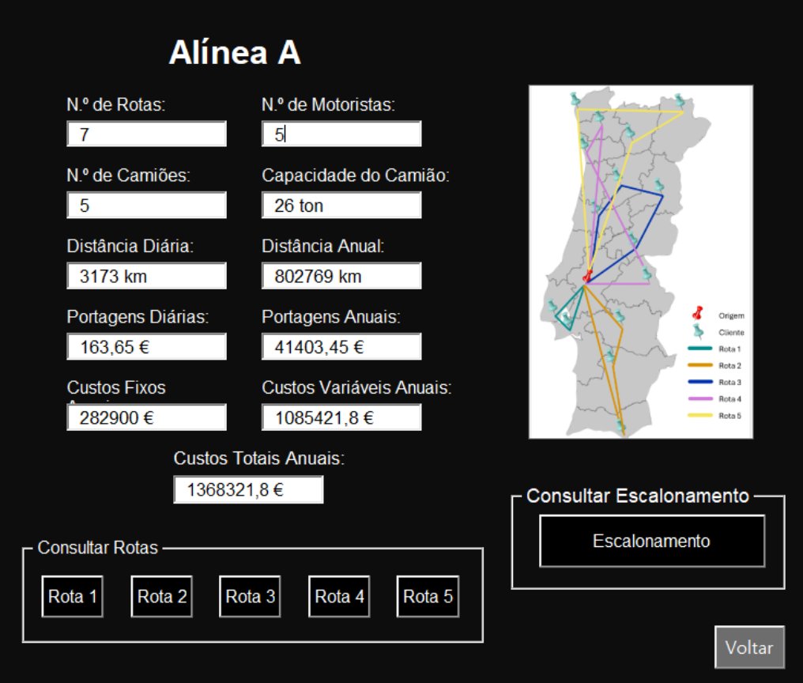
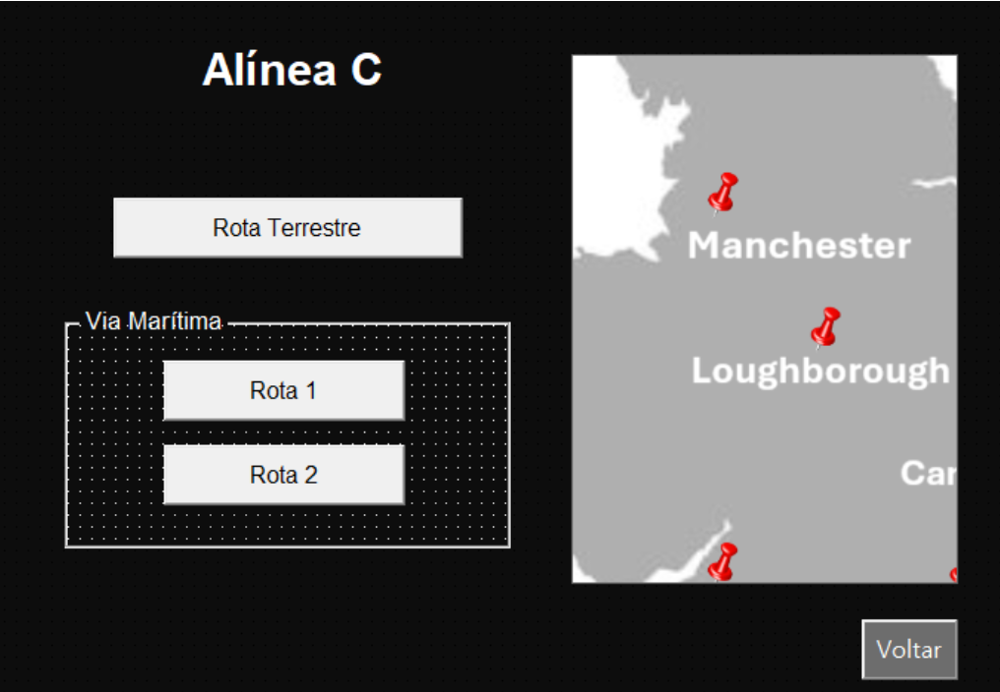
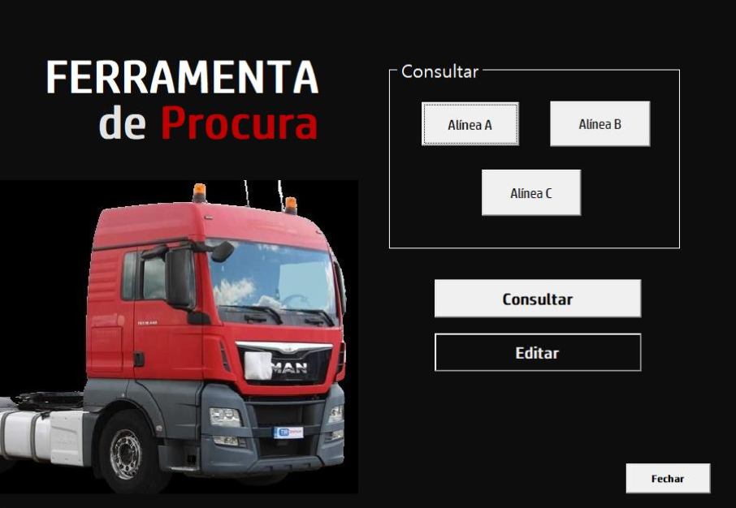
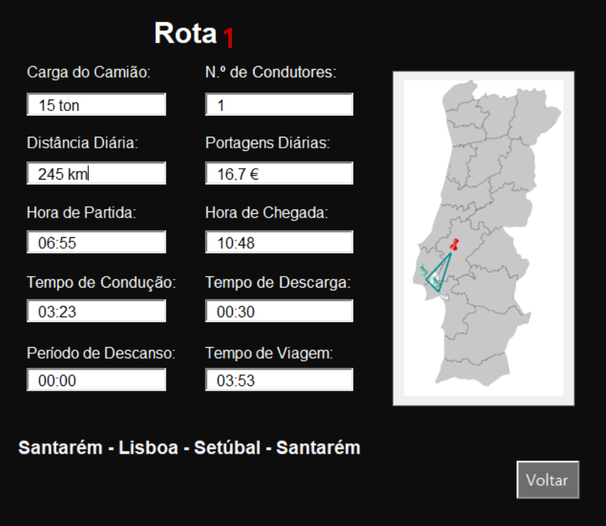
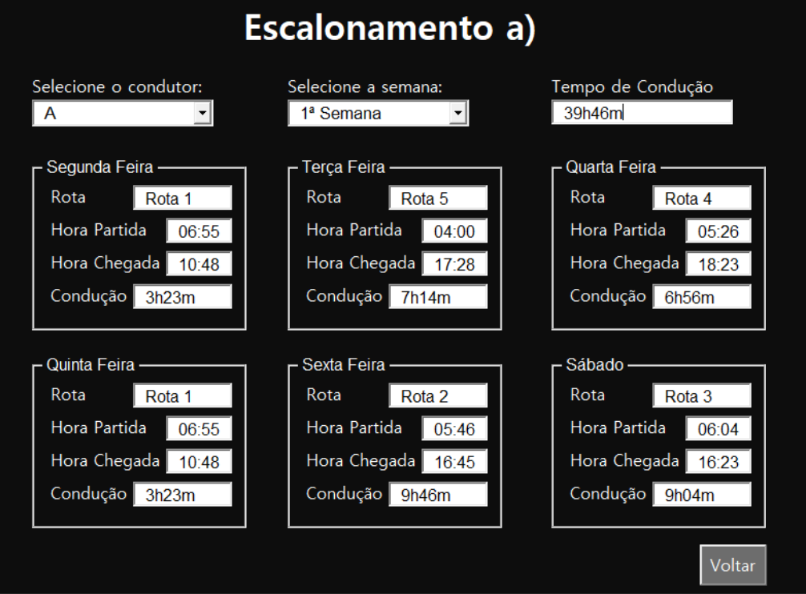
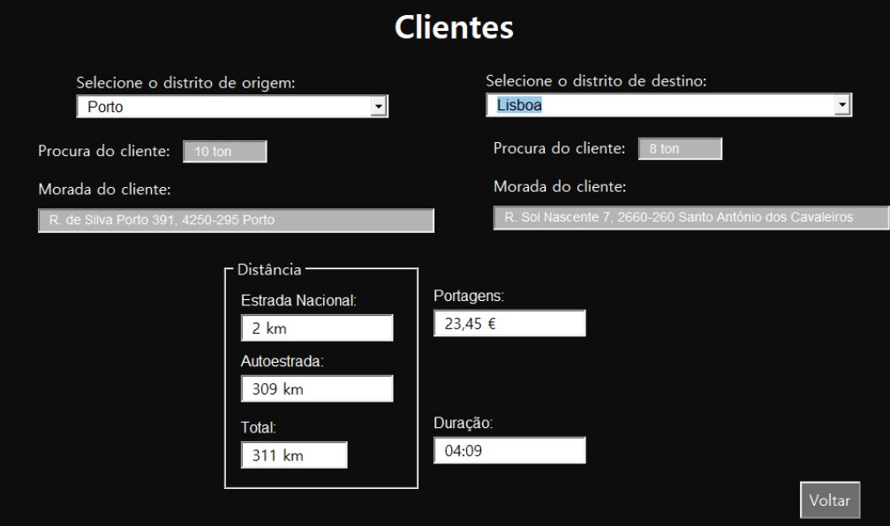
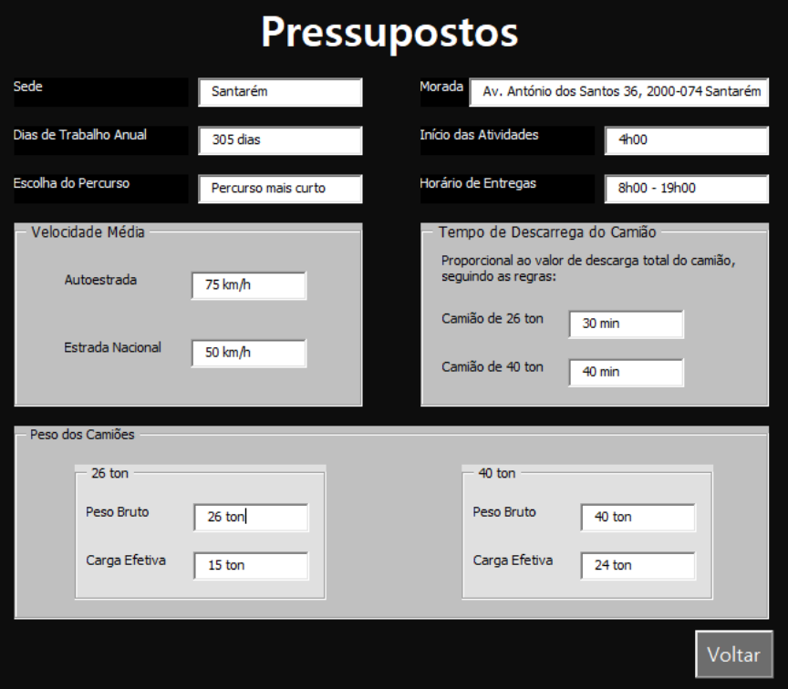

# 🚛 VRP — Otimização de Rotas de Distribuição

> Trabalho académico · Distribuição e Transportes · ISEP · Junho 2024  
> Licenciatura em Engenharia e Gestão Industrial — 3.º Ano

**Grupo:** Diana Fernandes · Diogo Rainho · Filipa Sousa Neves · Maria João Mota · Tomás Meireles

---

## Contexto do Problema

A empresa fictícia **VENDE&TUDO Distribuição S.A.**, sediada em Santarém, realiza entregas diárias a **15 clientes** distribuídos pelo território nacional. O objetivo é planear as rotas de distribuição de forma a minimizar custos e distâncias, respeitando a legislação laboral em vigor (Regulamento CE n.º 561/2006).

| Parâmetro | Valor |
|---|---|
| Sede / Origem | Santarém |
| Nº de clientes | 15 (de Mirandela a Faro) |
| Janela de entrega | 08h00 – 19h00 |
| Início das rotas | A partir das 04h00 |
| Velocidade (autoestrada / nacional) | 75 km/h · 50 km/h |
| Dias de trabalho por ano | 305 |

## Método — Vizinho Mais Próximo

Heurística construtiva implementada em **VBA** com restrições de capacidade. Em cada passo seleciona o cliente não visitado mais próximo do ponto atual, até esgotar a capacidade do camião — gerando então uma nova rota.

```
1. Partir de Santarém
2. Selecionar o cliente mais próximo ainda não visitado
3. Adicionar à rota se respeitar a capacidade do camião
4. Repetir até esgotar capacidade → nova rota
5. Regressar à origem
```

A revisão bibliográfica cobre também o **Método Clarke & Wright** (versão sequencial e paralela), usando a fórmula de poupança:

```
P(i,j) = d(0,i) + d(j,0) − d(i,j)
```

## Alínea A — Camiões de 26 ton (carga efetiva: 15 ton)



| Rota | Destinos | km/dia | Motoristas |
|---|---|---|---|
| 1 | Lisboa → Setúbal | 245 | 1 |
| 2 | Évora → Beja → Faro | 657 | 1 |
| 3 | Coimbra → Viseu → Guarda → C. Branco | 559 | 1 |
| 4 | Portalegre → Porto → Braga | 802 | 2 |
| 5 | Vila Real → Mirandela → Viana do Castelo | 910 | 2 |

**5 camiões · 7 motoristas · 3 173 km/dia · 1 368 321,80 €/ano**

## Alínea B — Camiões de 40 ton (carga efetiva: 24 ton)

As rotas iniciais do algoritmo violavam os horários de entrega (chegadas após as 19h). Foram ajustadas com a criação de uma 4.ª rota dedicada aos destinos mais a sul.

| Rota | Destinos | km/dia | Motoristas |
|---|---|---|---|
| 1.1 | Lisboa → Setúbal → Évora | 350 | 1 |
| 2.1 | Coimbra → Viseu → Guarda → C. Branco | 559 | 1 |
| 3.1 | Braga → Viana → Vila Real → Mirandela → Porto | 977 | 2 |
| 4.1 | Faro → Beja → Portalegre | 791 | 2 |

**4 camiões · 6 motoristas · 2 677 km/dia · 1 314 344,85 €/ano**

## Comparação A vs B

| | Alínea A (26 ton) | Alínea B (40 ton) | Diferença |
|---|---|---|---|
| Rotas/dia | 5 | 4 | −1 |
| Camiões | 5 | 4 | −1 |
| Motoristas | 7 | 6 | −1 |
| km/dia | 3 173 | 2 677 | −496 km |
| Custo anual | 1 368 321,80 € | 1 314 344,85 € | −53 976,95 € |

✅ **Os camiões de 40 ton são a solução mais eficiente.** Apesar de custos unitários mais elevados, a redução de ~500 km/dia e de um condutor compensam largamente.

## Alínea C — Transporte Internacional (DAP para Inglaterra)

Encomenda de **20 ton** (4 ton × 5 clientes: Manchester, Loughborough, Cambridge, Bristol, Londres).



| Rota | Percurso | Duração | Custo |
|---|---|---|---|
| 1 — Terrestre ✅ | Santarém → Vitória-Gasteiz → Le Mans → Londres | ~23h | 6 140 € |
| 2 — Lisboa–Southampton | Terrestre até Lisboa + ferry | ~4 dias | 4 817 € |
| 3 — Corunha–Southampton | Terrestre até Corunha + ferry | ~3 dias | 6 269 € |

✅ **Rota terrestre escolhida** — entrega em ~23h com um único meio de transporte, menor complexidade logística. A diferença de ~1 400 € face à opção mais barata justifica-se pela rapidez e simplicidade.

## Ferramenta Excel VBA

Interface gráfica interativa desenvolvida em VBA para consulta e gestão de todas as soluções.



### Detalhe de rota



### Escalonamento quinzenal de motoristas



### Consulta de clientes e distâncias



### Pressupostos configuráveis



**Funcionalidades:**
- Consultar dados de cada solução, rota e escalonamento
- Visualizar mapas de rotas integrados
- Editar procura de clientes e portagens com feedback de impacto
- Calcular automaticamente rotas pelo Método do Vizinho Mais Próximo
- Aceder a legislação e documentação necessária para transporte nacional e internacional

## Legislação Aplicada

Regulamento (CE) n.º 561/2006:

| Restrição | Valor |
|---|---|
| Condução diária máxima | 9h (extensível a 10h, 2×/semana) |
| Pausa obrigatória | 45 min após 4h30 de condução |
| Descanso diário mínimo | 11h consecutivas |
| Condução semanal máxima | 56h |
| Condução quinzenal máxima | 90h |

## Stack Técnica

**Excel Solver** · **VBA** · **Nearest Neighbor Heuristic** · **Clarke & Wright** · **Google Maps distances**

## Ficheiros

| Ficheiro | Descrição |
|---|---|
| `Ferramenta_VRP.xlsm` | Ferramenta Excel com macros VBA |

---

*Unidade Curricular de Distribuição e Transportes · Docente: Prof.ª Maria Teresa Pereira · ISEP — Instituto Superior de Engenharia do Porto · Junho 2024*
